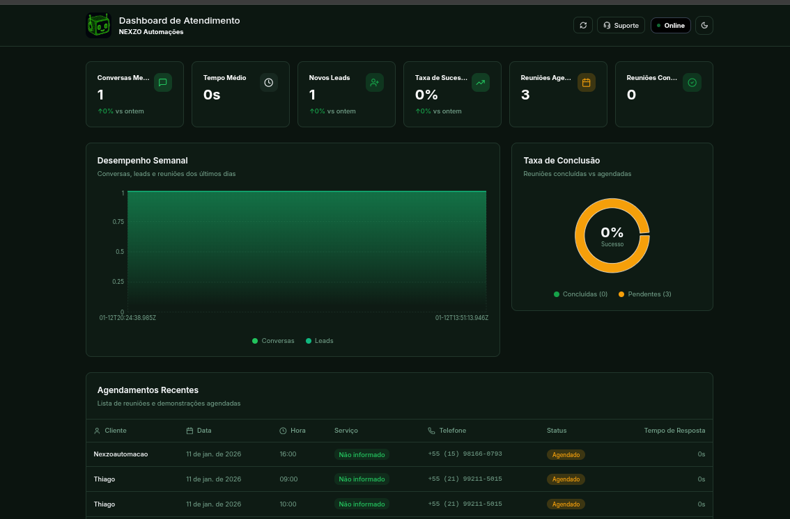

# Dashboard de Atendimento e Agendamento

Este projeto é um dashboard moderno para visualização de dados de atendimento e agendamento, focado em fornecer insights claros e métricas de performance.



## Link do Site
Acesse o dashboard online em: [https://dashboard.nexzoautomacoes.online/](https://dashboard.nexzoautomacoes.online/)

## Tecnologias Utilizadas

Este projeto foi desenvolvido utilizando as seguintes tecnologias:

- **Vite**: Ferramenta de build rápida para projetos web modernos.
- **TypeScript**: Superset de JavaScript que adiciona tipagem estática.
- **React**: Biblioteca para construção de interfaces de usuário.
- **shadcn-ui**: Componentes de interface reutilizáveis e acessíveis.
- **Tailwind CSS**: Framework CSS utilitário para estilização rápida.
- **Recharts**: Biblioteca de gráficos para visualização de dados.

## Como Executar Localmente

Para rodar o projeto em sua máquina local, siga os passos abaixo:

### Pré-requisitos
- Node.js instalado (versão 18 ou superior recomendada)
- npm ou pnpm

### Passos para Instalação

1. **Clonar o repositório:**
   ```sh
   git clone https://github.com/tavaresmirako/dashboard-dados-atendimento-agendamento.git
   ```

2. **Navegar até o diretório do projeto:**
   ```sh
   cd dashboard-dados-atendimento-agendamento
   ```

3. **Instalar as dependências:**
   ```sh
   npm install
   ```

4. **Iniciar o servidor de desenvolvimento:**
   ```sh
   npm run dev
   ```

O dashboard estará disponível em `http://localhost:8080`.

## Estrutura do Projeto

- `src/components`: Componentes reutilizáveis da interface.
- `src/pages`: Páginas principais da aplicação.
- `src/data`: Mock de dados ou integração com fontes de dados.
- `src/hooks`: Hooks customizados para lógica de estado e dados.
- `src/lib`: Utilitários e configurações de bibliotecas.
